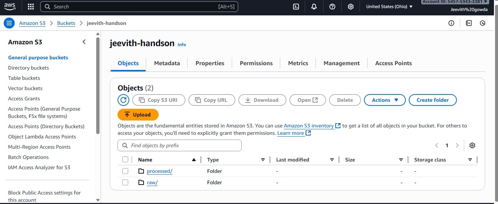
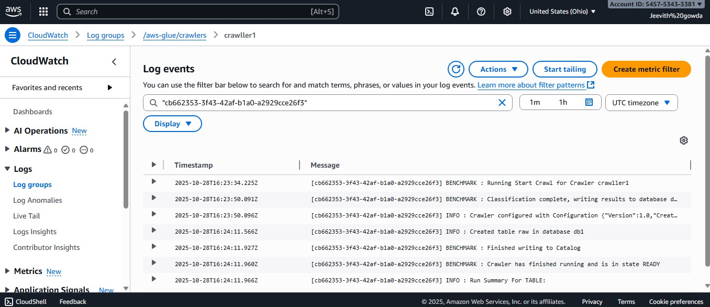
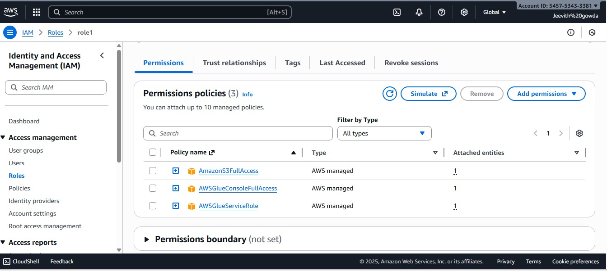

# AWS Athena E-Commerce Sales Analysis

## Project Overview
This project demonstrates the use of AWS core services (S3, Glue, CloudWatch, Athena) to analyze e-commerce sales data. The workflow involves setting up data storage, cataloging data with a crawler, and performing SQL queries for business insights.

## Dataset
- **Source**: [Kaggle E-Commerce Sales Dataset](https://www.kaggle.com/datasets/thedevastator/unlock-profits-with-e-commerce-sales-data)
- **Description**: Contains sales transactions with information about products, customers, profits, and discounts.

## Architecture & Workflow

1. **Data Storage (S3)**: Raw CSV data uploaded to S3 bucket
2. **IAM Role**: Created role with S3 and Glue permissions
3. **Data Cataloging (Glue Crawler)**: Automatically crawled and created table schema
4. **Monitoring (CloudWatch)**: Tracked crawler execution and logs
5. **Data Querying (Athena)**: Ran SQL queries for analysis

## AWS Components

### S3 Buckets

- `your-name-ecommerce-raw-data`: Stores raw CSV files
- `your-name-ecommerce-processed-data`: Stores Athena query results

### IAM Role

- **Role Name**: GlueCrawlerRole
- **Policies**: 
  - AWSGlueServiceRole
  - AmazonS3FullAccess

### CloudWatch Monitoring

- Monitored Glue crawler execution
- Verified successful data cataloging

## SQL Queries & Analysis

### Query 1: Cumulative Sales Over Time
**Purpose**: Calculate running total of sales for each day in 2023
**Business Value**: Understand sales accumulation patterns

[View Query](queries/query1_cumulative_sales.sql) | [View Results](results/q1.csv)

### Query 2: Geographic Hotspot Analysis
**Purpose**: Identify states with highest negative profits
**Business Value**: Target areas for cost reduction or product mix changes

[View Query](queries/query2_geographic_hotspot.sql) | [View Results](results/query2_results.csv)

### Query 3: Discount Impact on Profitability
**Purpose**: Analyze how different discount levels affect profit ratios by sub-category
**Business Value**: Optimize discount strategies

[View Query](queries/query3_discount_impact.sql) | [View Results](results/query3_results.csv)

### Query 4: Top 3 Most Profitable Products
**Purpose**: Rank top 3 products by profit within each category
**Business Value**: Focus on high-performing products

[View Query](queries/query4_top_products.sql) | [View Results](results/query4_results.csv)

### Query 5: Monthly Growth Analysis
**Purpose**: Calculate month-over-month growth rates for sales and profit
**Business Value**: Track business performance trends

[View Query](queries/query5_monthly_growth.sql) | [View Results](results/query5_results.csv)

## Key Insights
- [Add your findings after running queries]
- Example: "Technology category shows highest profitability"
- Example: "Discounts above 20% significantly reduce profit margins"

## Technical Challenges & Solutions
- **Challenge**: Column names in Athena different from CSV headers
  - **Solution**: Previewed table schema before writing queries
- **Challenge**: Date format conversion
  - **Solution**: Used CAST and DATE_TRUNC functions

## How to Reproduce

1. Clone this repository
2. Download dataset from Kaggle
3. Follow AWS setup steps in queries/
4. Upload data to S3
5. Create and run Glue crawler
6. Execute queries in Athena

## Tools & Technologies
- AWS S3
- AWS Glue
- AWS Athena
- AWS CloudWatch
- AWS IAM
- SQL

## Author
Jeevith Doddalingegowda Rama - ITCS 6190/8190, Fall 2025

## Acknowledgments
- Dataset from Kaggle
- Assignment by Professor Marco Vieira, UNC Charlotte
